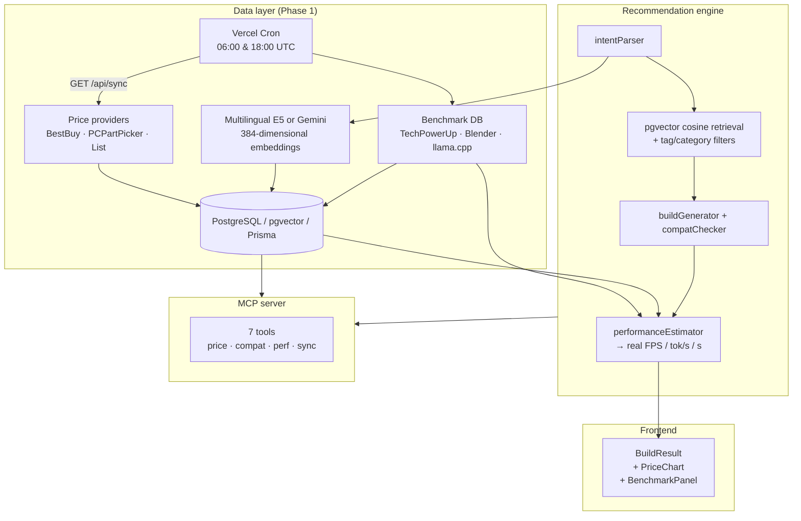

# PCBuilder V2

An explainable RAG-augmented PC recommendation system built with Next.js, React, TypeScript, Tailwind CSS, Recharts, DeepSeek V4, and Gemini — now with a **real-time North American price + benchmark data layer** (Phase 1).

## What's new in Phase 1

- **Live price data layer** with provider abstraction (BestBuy API + PCPartPicker fallback + list baseline)
- **Historical price storage** — one `PriceSnapshot` row per (part, retailer, timestamp), powering the 30-day price chart
- **Scheduled sync** — Vercel Cron triggers `/api/sync` at 06:00 & 18:00 UTC for prices, weekly for benchmarks
- **Public benchmark database** — curated from TechPowerUp / Hardware Unboxed / Blender Open Data / llama.cpp
- **Real numeric estimates** — FPS (Cyberpunk 2077), token/s (Llama 7B/13B/70B Q4), Blender Classroom render seconds, Cinebench 2024
- **MCP tool surface** — price / benchmark / compatibility / performance exposed as MCP tools for AI agents
- **PostgreSQL + pgvector + Prisma** for durable prices, benchmarks, knowledge chunks, and HNSW semantic retrieval
- **Real vector RAG** with multilingual E5 embeddings by default, plus an optional Gemini Embedding 2 backend

## Run locally

```bash
npm install
cp .env.example .env.local          # fill in BESTBUY_API_KEY for live US prices (optional)
npm run db:up                       # start local PostgreSQL + pgvector
npm run db:migrate                  # create schema and HNSW vector index
npm run db:seed                     # seed 54 parts + baseline prices + 69 benchmark rows
npm run db:import-sqlite             # one-time import of legacy price history (optional)
npm run rag:index                   # embed and index knowledge chunks
npm run sync:prices                 # pull live prices from configured providers
npm run sync:benchmarks             # load curated benchmark data into DB
npm run dev
```

Open `http://localhost:3000/build/chat` for the natural-language RAG builder, or `/build` for the form-based builder. Each build result now shows:
- **BenchmarkPanel** — concrete FPS, token/s, render seconds with source attribution
- **PriceChart** — 30-day price history for the selected GPU

## Draft-first multi-turn agent

`/build/chat` creates a visible baseline immediately, then accepts short follow-ups such as `换成 5090`, `不要水冷`, `更白一点`, `便宜一点`, or `为什么不用 14900K`.

- **Patch** locks every unaffected category. Compatibility may add a narrowly scoped linked change (for example, a higher-wattage PSU after a GPU upgrade).
- **Optimize** keeps explicit part locks and changes at most three components to lower cost.
- **Explain** never mutates the build.
- **Rebuild** runs only for an explicit overall rejection, a new total budget, or language such as `太贵了` / `重新配`.

Common edits use deterministic routing without an LLM call. Ambiguous turns use compact structured messages. DeepSeek conversations append prior `user` and `assistant` messages as documented in [Multi-round Conversation](https://api-docs.deepseek.com/guides/multi_round_chat); stable prefixes allow DeepSeek's default [Context Caching](https://api-docs.deepseek.com/guides/kv_cache) to apply. Cache hit/miss token counts are returned in `interaction.tokenUsage` and shown in the chat UI.

## Architecture



### Deterministic-first principle

1. The selected DeepSeek V4 or Gemini model parses natural language into a structured `BuildRequest`, with a deterministic local fallback.
2. The retrieval layer embeds each category-specific query, runs cosine similarity against a pgvector HNSW index, and applies tag/category filters. A visibly labeled keyword fallback is used only when semantic retrieval is unavailable.
3. The candidate retriever builds a scored part pool for each category using performance, value, RAG relevance, preferences, and upgradeability.
4. The recommendation engine selects only from those pools. Gemini never invents the final hardware list.
5. Deterministic rules validate socket, memory type, PSU headroom, clearances, cooler height, and motherboard form factor.
6. `performanceEstimator` now pulls **real benchmark rows** from the DB (FPS, token/s, render seconds) and falls back to relative tiers only when no data exists.
7. The selected model explains the final build using retrieved evidence citations. It is explicitly prohibited from inventing prices, benchmarks, or inventory.

## Environment

Copy `.env.example` to `.env.local`:

| Variable | Purpose | Required |
|----------|---------|----------|
| `DATABASE_URL` | PostgreSQL connection string. The example matches `docker-compose.yml`. | yes |
| `EMBEDDING_PROVIDER` | `local` (multilingual E5) or `gemini`. Changing provider requires re-indexing. | yes |
| `LOCAL_EMBEDDING_MODEL` | Transformers.js embedding model, default `Xenova/multilingual-e5-small`. | local RAG |
| `HF_ENDPOINT` | Hugging Face model host used for the initial local model download. | no |
| `EMBEDDING_MODEL` | Gemini embedding model when provider is `gemini`. | Gemini RAG |
| `BESTBUY_API_KEY` | BestBuy official Products API (US prices). Without it, falls back to PCPartPicker + list prices. | no |
| `DEEPSEEK_API_KEY` | DeepSeek V4 for intent parsing + explanation. | no |
| `GEMINI_API_KEY` | Gemini 2.5 Flash as alternate AI provider. | no |
| `SYNC_API_TOKEN` | Bearer token protecting `/api/sync`. Open in dev, required in prod. | prod |
| `CRON_SECRET` | Secret Vercel sends as a bearer token on scheduled sync requests. | Vercel prod |
| `PRICE_REGION` | Default `US`. | no |

## API

| Route | Method | Purpose |
|-------|--------|---------|
| `/api/recommend` | POST | Form-based build generation |
| `/api/rag/recommend` | POST | Natural-language RAG build generation |
| `/api/parts/[partId]` | GET | Current price + 30d stats + benchmarks for one part |
| `/api/prices?partIds=...&days=30` | GET | Historical price series (or `&current=1` for latest only) |
| `/api/sync?source=prices\|benchmarks\|all` | GET / POST | Trigger a sync run (GET for Vercel Cron, POST for manual use) |

## MCP server

A standalone MCP server exposes 7 tools so any MCP-compatible AI client (Cursor, Claude Desktop, etc.) can query live prices, run compatibility checks, get real benchmark estimates, and trigger syncs.

```bash
npx tsx src/lib/mcp/server.ts
```

Or register it in `.cursor/mcp.json` (already scaffolded) to use the tools inside Cursor chat. Tools: `get_current_price`, `get_price_history`, `get_benchmarks`, `check_compatibility`, `estimate_performance`, `sync_prices`, `list_parts`.

## Commands

```bash
npm run typecheck
npm run build
npm run db:up              # local PostgreSQL + pgvector
npm run db:migrate         # apply versioned schema migrations
npm run db:seed            # seed parts + baseline prices + benchmarks
npm run db:import-sqlite   # idempotent import of legacy SQLite prices/sync logs
npm run rag:index          # embed knowledge chunks into pgvector
npm run rag:eval           # semantic retrieval regression set
npm run sync:prices        # live price refresh
npm run sync:benchmarks    # load curated benchmark data
npm run sync:all           # seed + RAG index + prices + benchmarks
```

## Data sources

| Source | What it provides | Region |
|--------|------------------|--------|
| [BestBuy API](https://developer.bestbuy.com) | Live US retail prices + stock | US |
| [PCPartPicker](https://pcpartpicker.com) | Aggregated US/CA prices (fallback) | US/CA |
| [TechPowerUp](https://www.techpowerup.com/reviews) | GPU/CPU FPS + Cinebench scores | global |
| [Hardware Unboxed](https://www.youtube.com/@HardwareUnboxed) | AMD GPU FPS reviews | global |
| [Blender Open Data](https://opendata.blender.org) | Blender Classroom render seconds | global |
| [llama.cpp](https://github.com/ggerganov/llama.cpp) | LLM token/s (CUDA + Vulkan) | global |

Prices from live providers are USD. The UI converts to the requested currency using the existing `priceEstimator`. List prices remain as a last-resort baseline so the app always works offline.

## Roadmap (post-Phase 1)

- **Phase 2** — expand sourced knowledge ingestion, retrieval evaluation, and RAG flow share links
- **Phase 3** — multi-agent orchestration (budget / compatibility / performance / price specialists)
- **Phase 4** — expand the part catalog to thousands and add hybrid reranking
- **Phase 5** — affiliate product URLs + one-click cart

Prices from live providers are real-time snapshots, not live listings. Historical accuracy depends on cron run frequency.

### Multi-turn request shape

The first call sends `{ query, model, thinking }`. Follow-ups send the latest recommendation as `currentBuild`:

```json
{ "query": "换成 5090", "currentBuild": { "...": "previous response" }, "model": "deepseek-v4-flash", "thinking": "disabled" }
```

The response remains a `RagBuildRecommendation` and adds `interaction.action`, `changedParts`, `preservedCategories`, the bounded model context, and optional cache/token usage.
