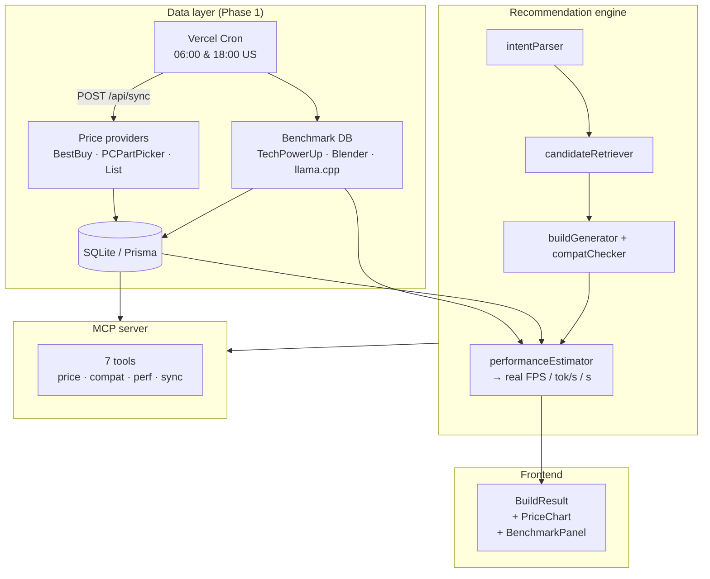

# PCBuilder V2

An explainable RAG-augmented PC recommendation system built with Next.js, React, TypeScript, Tailwind CSS, Recharts, DeepSeek V4, and Gemini — now with a **real-time North American price + benchmark data layer** (Phase 1).

## What's new in Phase 1

- **Live price data layer** with provider abstraction (BestBuy API + PCPartPicker fallback + list baseline)
- **Historical price storage** — one `PriceSnapshot` row per (part, retailer, timestamp), powering the 30-day price chart
- **Scheduled sync** — Vercel Cron triggers `/api/sync` at 06:00 & 18:00 US time for prices, weekly for benchmarks
- **Public benchmark database** — curated from TechPowerUp / Hardware Unboxed / Blender Open Data / llama.cpp
- **Real numeric estimates** — FPS (Cyberpunk 2077), token/s (Llama 7B/13B/70B Q4), Blender Classroom render seconds, Cinebench 2024
- **MCP tool surface** — price / benchmark / compatibility / performance exposed as MCP tools for AI agents
- **SQLite + Prisma** for dev (migrate to Postgres for prod by changing `DATABASE_URL`)

## Run locally

```bash
npm install
cp .env.example .env.local          # fill in BESTBUY_API_KEY for live US prices (optional)
npm run db:push                     # create the SQLite schema
npm run db:seed                     # seed 52 parts + baseline prices + 69 benchmark rows
npm run sync:prices                 # pull live prices from configured providers
npm run sync:benchmarks             # load curated benchmark data into DB
npm run dev
```

Open `http://localhost:3000/build/chat` for the natural-language RAG builder, or `/build` for the form-based builder. Each build result now shows:
- **BenchmarkPanel** — concrete FPS, token/s, render seconds with source attribution
- **PriceChart** — 30-day price history for the selected GPU

## Architecture



### Deterministic-first principle

1. The selected DeepSeek V4 or Gemini model parses natural language into a structured `BuildRequest`, with a deterministic local fallback.
2. A replaceable retrieval layer searches local `KnowledgeChunk` seed data by keyword, category, and tags. Its interface can later be backed by pgvector.
3. The candidate retriever builds a scored part pool for each category using performance, value, RAG relevance, preferences, and upgradeability.
4. The recommendation engine selects only from those pools. Gemini never invents the final hardware list.
5. Deterministic rules validate socket, memory type, PSU headroom, clearances, cooler height, and motherboard form factor.
6. `performanceEstimator` now pulls **real benchmark rows** from the DB (FPS, token/s, render seconds) and falls back to relative tiers only when no data exists.
7. The selected model explains the final build using retrieved evidence citations. It is explicitly prohibited from inventing prices, benchmarks, or inventory.

## Environment

Copy `.env.example` to `.env.local`:

| Variable | Purpose | Required |
|----------|---------|----------|
| `DATABASE_URL` | Prisma datasource. Use `file:./dev.db` for SQLite. | yes |
| `BESTBUY_API_KEY` | BestBuy official Products API (US prices). Without it, falls back to PCPartPicker + list prices. | no |
| `DEEPSEEK_API_KEY` | DeepSeek V4 for intent parsing + explanation. | no |
| `GEMINI_API_KEY` | Gemini 2.5 Flash as alternate AI provider. | no |
| `SYNC_API_TOKEN` | Bearer token protecting `/api/sync`. Open in dev, required in prod. | prod |
| `PRICE_REGION` | Default `US`. | no |

## API

| Route | Method | Purpose |
|-------|--------|---------|
| `/api/recommend` | POST | Form-based build generation |
| `/api/rag/recommend` | POST | Natural-language RAG build generation |
| `/api/parts/[partId]` | GET | Current price + 30d stats + benchmarks for one part |
| `/api/prices?partIds=...&days=30` | GET | Historical price series (or `&current=1` for latest only) |
| `/api/sync?source=prices\|benchmarks\|all` | POST | Trigger a sync run (cron or manual) |

## MCP server

A standalone MCP server exposes 7 tools so any MCP-compatible AI client (Cursor, Claude Desktop, etc.) can query live prices, run compatibility checks, get real benchmark estimates, and trigger syncs.

```bash
npx tsx src/lib/mcp/server.ts
```

Or register it in `.cursor/mcp.json` (already scaffolded) to use the tools inside Cursor chat. Tools: `get_current_price`, `get_price_history`, `get_benchmarks`, `check_compatibility`, `estimate_performance`, `sync_prices`, `list_parts`.

## Commands

```bash
npm run typecheck
npm run build
npm run db:seed            # seed parts + baseline prices + benchmarks
npm run sync:prices        # live price refresh
npm run sync:benchmarks    # load curated benchmark data
npm run sync:all           # seed + prices + benchmarks
```

## Data sources

| Source | What it provides | Region |
|--------|------------------|--------|
| [BestBuy API](https://developer.bestbuy.com) | Live US retail prices + stock | US |
| [PCPartPicker](https://pcpartpicker.com) | Aggregated US/CA prices (fallback) | US/CA |
| [TechPowerUp](https://www.techpowerup.com/reviews) | GPU/CPU FPS + Cinebench scores | global |
| [Hardware Unboxed](https://www.youtube.com/@HardwareUnboxed) | AMD GPU FPS reviews | global |
| [Blender Open Data](https://opendata.blender.org) | Blender Classroom render seconds | global |
| [llama.cpp](https://github.com/ggerganov/llama.cpp) | LLM token/s (CUDA + Vulkan) | global |

Prices from live providers are USD. The UI converts to the requested currency using the existing `priceEstimator`. List prices remain as a last-resort baseline so the app always works offline.

## Roadmap (post-Phase 1)

- **Phase 2** — multi-turn conversational build edits; RAG flow share links
- **Phase 3** — multi-agent orchestration (budget / compatibility / performance / price specialists)
- **Phase 4** — pgvector knowledge retrieval; expand part catalog to thousands
- **Phase 5** — affiliate product URLs + one-click cart

Prices from live providers are real-time snapshots, not live listings. Historical accuracy depends on cron run frequency.
